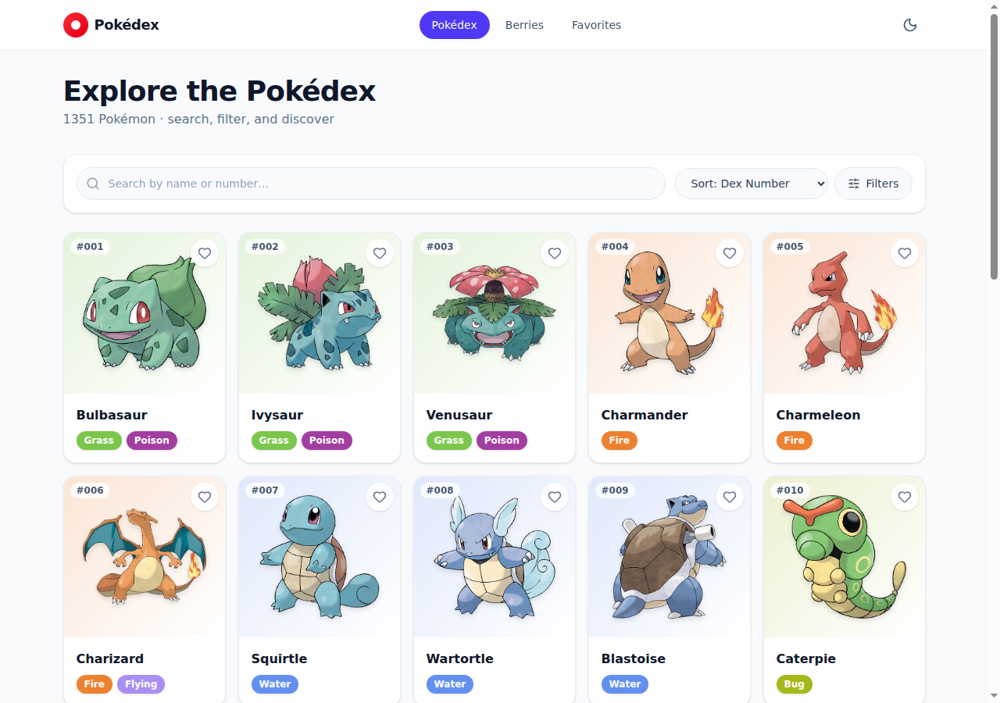
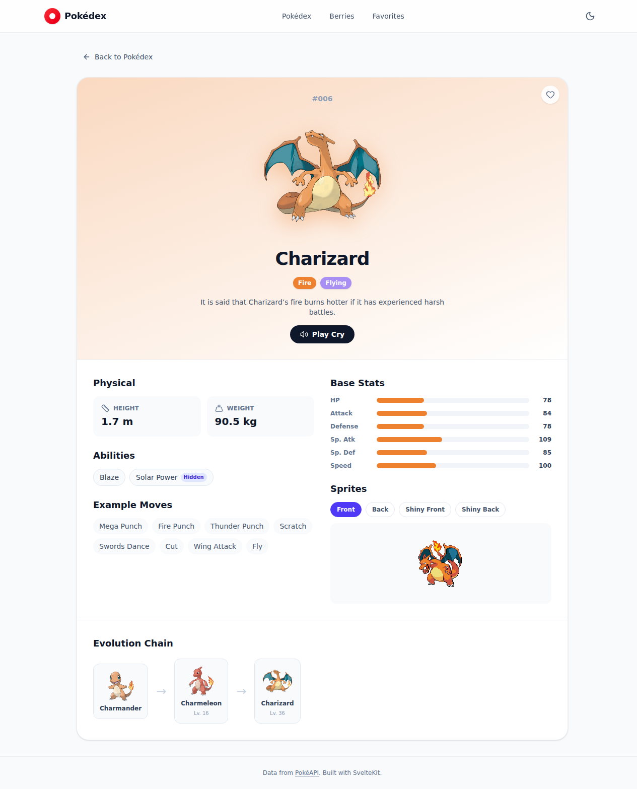
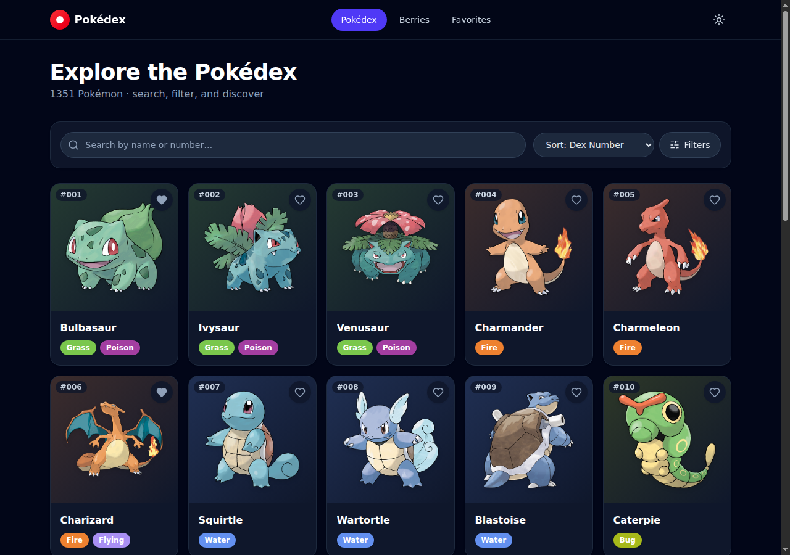
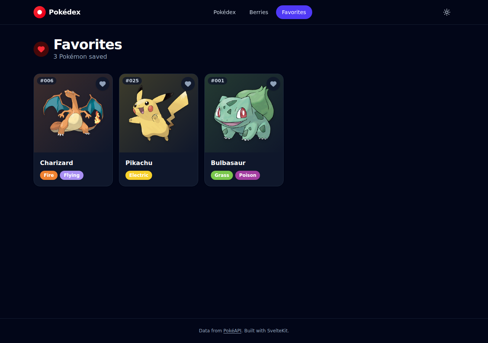
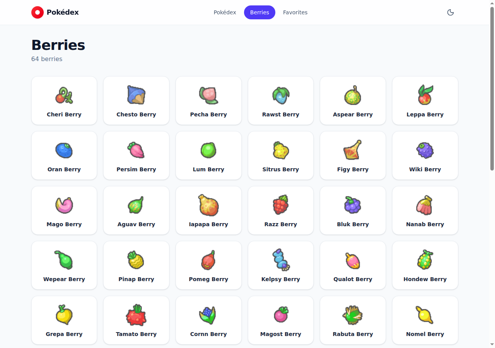
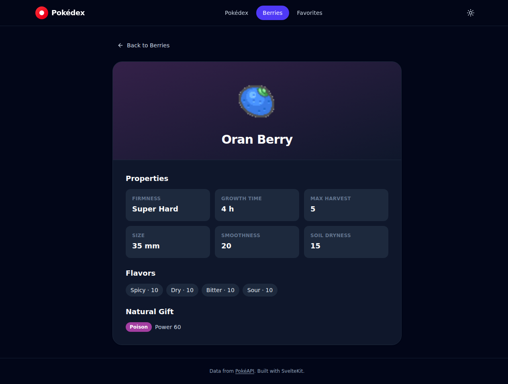
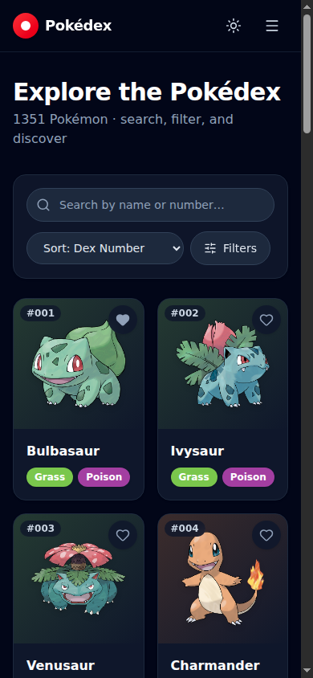

#  Pokédex

**A fast, animated, fully client-rendered Pokédex — search, filter, and explore every Pokémon and berry from [PokéAPI](https://pokeapi.co).**

[**🔴 Live demo →**](https://azagatti.github.io/pokedex-sum-sm1/)

[](https://github.com/AZagatti/pokedex-sum-sm1/actions/workflows/ci.yml)     

---

## Screenshots

| Pokédex list (light) | Pokémon detail |
| --- | --- |
|  |  |

| Pokédex list (dark) | Favorites (dark) |
| --- | --- |
|  |  |

| Berries | Berry detail (dark) |
| --- | --- |
|  |  |

| Mobile                                                                 |
| ---------------------------------------------------------------------- |
|  |

## Features

- **Pokédex list** — responsive card grid with type-colored gradients, infinite scroll (30/page via `IntersectionObserver`), and skeleton loaders while sprites load.
- **Search & filters** — debounced (250ms) name/number search, multi-select generation (1–9) and type (18) filters, sort by dex number or base-stat total, one-click clear.
- **Pokémon detail** — official artwork with a spring-eased entrance animation, animated base-stat bars, abilities (hidden ability flagged), example moves, a clickable evolution chain, a front/back/shiny sprite switcher, and a play-cry button.
- **Berries** — list and detail pages with firmness, flavors, growth time, size, and natural-gift type/power.
- **Favorites** — heart any Pokémon from a card or its detail page; persists to `localStorage` and survives reload.
- **Theme** — light/dark toggle, respects `prefers-color-scheme` on first visit, persisted.
- **Accessibility** — labeled controls, visible focus rings, `aria-pressed`/`aria-expanded` state, `prefers-reduced-motion` support throughout.
- **404 & error states** — themed not-found page, empty states on every list, defensive handling of partial/broken API data.

## Tech stack

| Layer | Choice |
| --- | --- |
| Framework | [SvelteKit](https://svelte.dev/docs/kit) (Svelte 5 runes) + TypeScript (strict) |
| Deployment | `@sveltejs/adapter-static` — SPA mode, `paths.base` set for GitHub Pages |
| Styling | Tailwind CSS v4 + hand-written CSS for motion, `lucide-svelte` icons |
| Data fetching | native `fetch` in `load` functions + a small in-memory `Map` cache — no data-fetching library |
| Validation | [Zod](https://zod.dev) — every PokéAPI response is parsed against a schema before use |
| State | Svelte 5 runes + two `localStorage`-backed stores (favorites, theme) |
| Testing | [Vitest](https://vitest.dev) (unit) + [Playwright](https://playwright.dev) (e2e) |
| Lint/format | [ultracite](https://ultracite.ai) driving [oxlint](https://oxc.rs) + oxfmt |
| Git hooks | [lefthook](https://github.com/evilmartians/lefthook) — lint/format/typecheck on commit, full test suite on push |
| CI/CD | GitHub Actions — lint → typecheck → unit tests → build → e2e tests → deploy to Pages |

See [`docs/DECISIONS.md`](docs/DECISIONS.md) for the reasoning behind each pinned choice, and [`docs/ARCHITECTURE.md`](docs/ARCHITECTURE.md) for data flow, caching, and route structure.

## Run locally

```bash
npm install
npm run dev       # http://localhost:5173
```

Other scripts:

```bash
npm run build      # production build (SPA, static/build/)
npm run preview    # preview the production build
npm run check      # svelte-check (TypeScript)
npm run lint        # oxlint + oxfmt --check
npm run format      # oxlint --fix + oxfmt --write
npm run test:unit   # vitest
npm run test:e2e    # playwright (builds + previews first)
npm run test        # unit + e2e
```

Git hooks are installed automatically via `npm install` (the `prepare` script runs `lefthook install`). Pre-commit runs lint/format/typecheck on staged files; pre-push runs the full test suite.

## Architecture

Quick summary — full detail in [`docs/ARCHITECTURE.md`](docs/ARCHITECTURE.md):

```
src/
├─ lib/
│  ├─ api/          # PokeAPI client, zod schemas, in-memory cache
│  ├─ components/    # PokemonCard, TypeBadge, StatBar, Header, ...
│  ├─ stores/        # theme.svelte.ts, favorites.svelte.ts (runes + localStorage)
│  └─ utils/         # type colors, name formatting, evolution-chain flattening
├─ routes/
│  ├─ +page.svelte              # / — list, search, filters, infinite scroll
│  ├─ pokemon/[name]/+page.svelte
│  ├─ berries/(+page|[name])
│  └─ favorites/+page.svelte
e2e/                # Playwright specs
```

Every dynamic route (`/pokemon/[name]`, `/berries/[name]`, `/favorites`) is client-rendered (`ssr = false`) and served through the adapter-static SPA fallback (`404.html`) on GitHub Pages, since Pages can't run a Node server. The list and berries index pages are prerendered so the deployed root loads instantly with real content, then hydrates into the interactive SPA.

## CI/CD

Every push to `main` and every PR runs: install → lint → typecheck → unit tests → build → Playwright e2e tests against the built app. On `main`, a successful run uploads the `build/` output as a Pages artifact and deploys it via `actions/deploy-pages`.

## Data source

All data comes from the public [PokéAPI](https://pokeapi.co) (`https://pokeapi.co/api/v2`) — no key required, no backend of our own.
